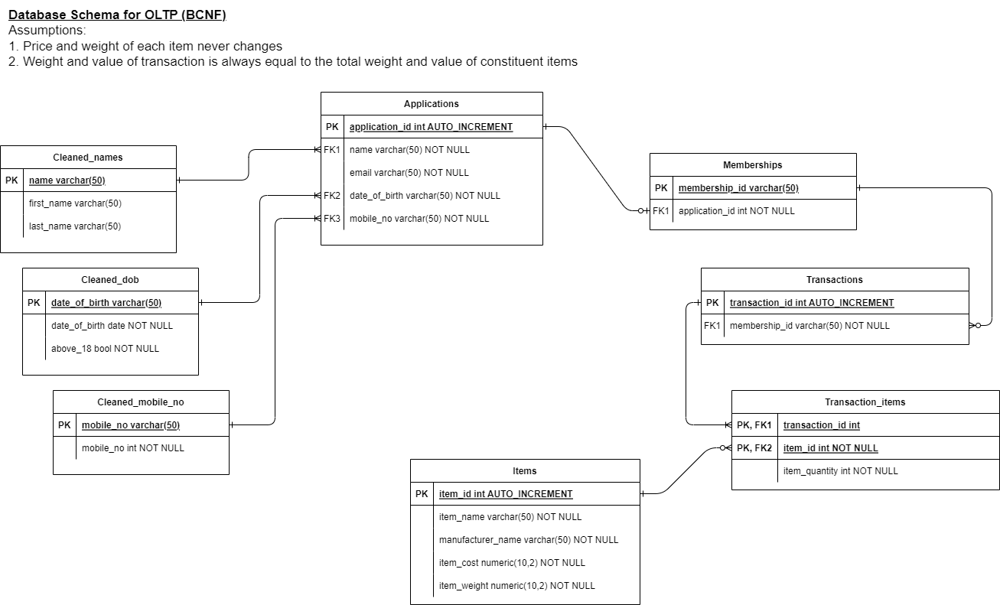

# Section 1
* cron expression should be 0 0 * * *, not 0 * * 
* email validity check is inverted.
    * it should be:
```df.loc[~df["email"].str.match(email_regex), "is_valid"] = False```
    * instead of:
``` df.loc[df["email"].str.match(email_regex), "is_valid"] = False```

# Section 2

* Typo: Transaction and Transaction_items should be inverted in the table
* Schema can be separated into OLTP vs OLAP if we expect high traffic. High volume of read/write would necessitate normalized data form so that data redundancy is reduced and transactions in the database can be updated quickly:



Improvements
* Define foreign keys in each DDL statement, which will help to maintain referential integrity. For example:
```
CREATE TABLE memberships (
    membership_id varchar(50) PRIMARY KEY,
    application_id int NOT NULL,
    name VARCHAR(50) NOT NULL,
    email VARCHAR(50) NOT NULL,
    mobile_no int NOT NULL,
    date_of_birth date NOT NULL,
    above_18 bool NOT NULL,
    first_name varchar(50) NOT NULL,
    last_name varchar(50) NOT NULL,
    FOREIGN KEY (application_id) REFERENCES applications(application_id)
); 
```


# Section 3
### Logistics:
* Instead of 'write access', should be **Create access** instead, so that they can add new rows of data

### Logistics (alternative design):
* Instead of 'write access to a specific column', should be **update access** instead

### Analytics:
* **Don't grant Create, Update or Delete access; only grant Read access**


### Sales:
* Instead of 'Grant write access', should be **grant Create and Delete access**

# Section 4

Issues with [API](https://api.covid19api.com/total/country/singapore):
* After 2023-02-12, data updated very infrequently
