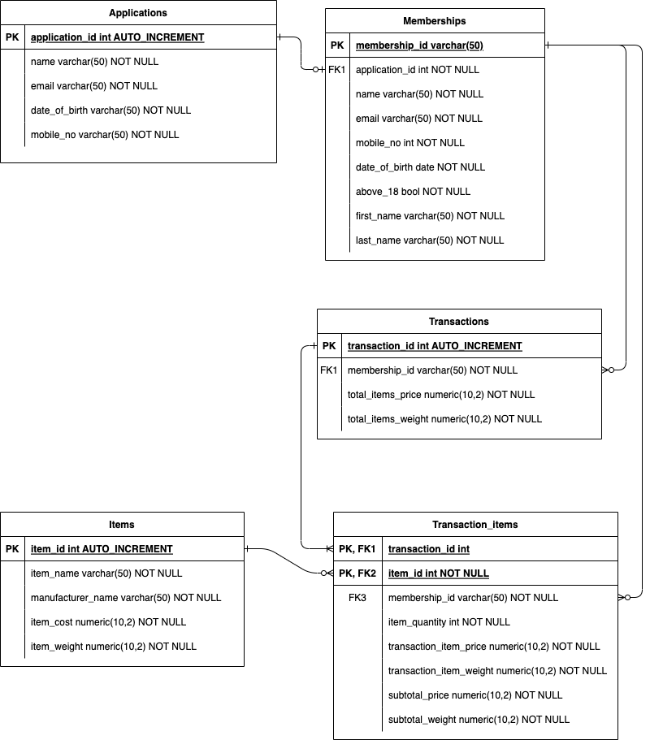

# Entity relationship diagram

|Table|Explanatory Notes|
|---|---|
|**Applications**|1. There are duplicate rows in the raw data, hence none of the existing columns can be used as a primary key.  2. Add a new column application_id which will uniquely identify each application. This column is AUTO INCREMENT (aka SERIAL in Postgre) and will be the primary key.   3. All the data fields are in varchar format as the data is not cleaned yet and could have information in varying formats|
|**Memberships**|1. Assumption: This table only contains the successful members.   2. membership_id is the primary key - this is the field created in section 1.   3. application_id is the foreign key so that we can find the application_id relating to this membership. It will also allow for analysis of how many applications lead to memberships   4. mobile_no should be cleaned and is stored in int format. Similarly, date of birth is also cleaned and stored in date format.|
|**Transaction_items**|1. This table contains information about transactions, without details on which items were transacted.   2. Each row represents one transaction_id. The transaction_id is the primary key and is auto incremented so that each transaction has a unique id.   3. Having a separate transaction table allows for quick analysis on the number of transactions by each member. The total price and weight is already computed, reducing the compute resources required for transaction-level analyses where there is no need to for information on the items within the transaction.|
|**Transactions**|1. This table contains information about items transacted. It uses a composite primary key of transaction_id and item_id.   2. This allows data analysts to easily perform analysis on transactions on an item-level.   3. The transacted price and weight of each item is stored here. This is required because the price and weight of the items (in the Items table) may change from time to time, and we might still need to refer to the transacted price and weight subsequently.|
|**Items**|1. This table contains information about the item.   2. The primary key is an auto incrementing field called item_id, which allows each unique item to be identified separately, even if they happen to have the same item name.|

# Other solution files
* [Dockerfile](Dockerfile)
* [DDL - CREATE Applications](create_applications.sql)
* [DDL - CREATE Memberships](create_memberships.sql)
* [DDL - CREATE Transactions](create_transaction.sql)
* [DDL - CREATE Transaction Items](create_transaction_items.sql)
* [DDL - CREATE Items](create_items.sql)
* [Query - top 10 members by spending](queries/top_10_members.sql)
* [Query - top 3 items frequently bought by members](queries/top_3_items.sql)