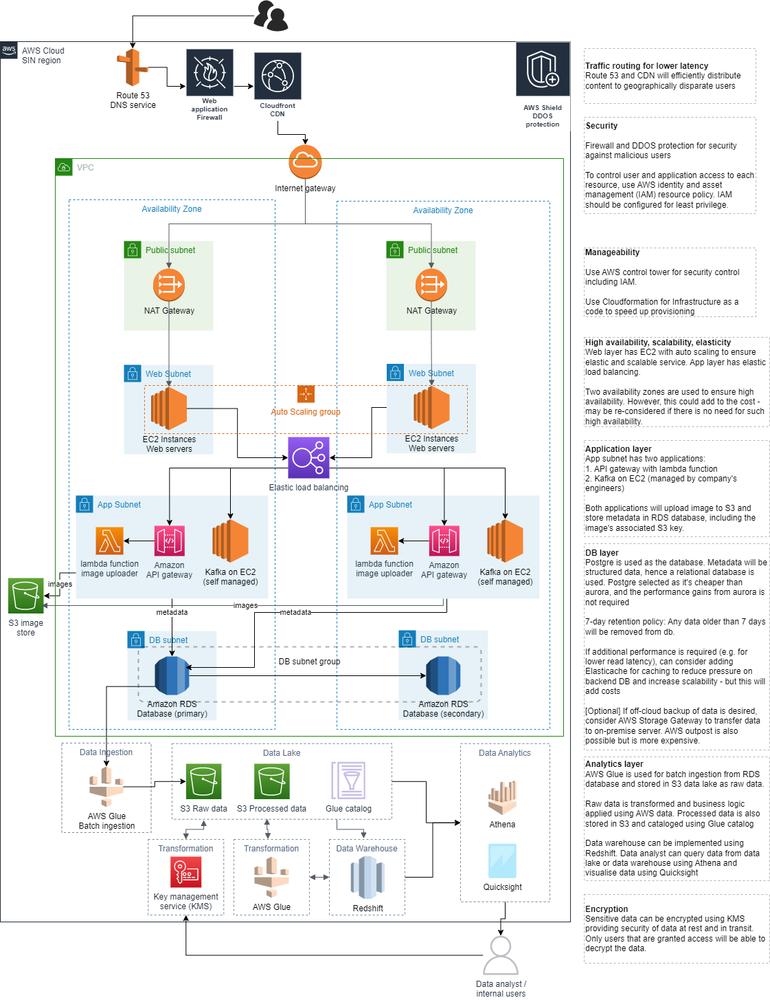

# Design 1

### Logistics:
* Grant read access to the transactions and transaction_items table to the logistics team.
* Grant write access to the transactions and transaction_items table for the logistics team to update the table for completed transactions.
* Grant read access to the items table for the logistics team to retrieve other information about the items bought.

### Logistics (alternative design):
* A more robust design would be to have a state machine for transactions.
* Namely, we can insert a 'status' column for the transaction-related tables which will represents its state. For example, status = 1 may be 'preparing', status = 2 may be 'shipped', and status = 3 may be 'completed'.
* Then, instead of giving the logistics team write access to the whole table, they can instead  be granted write access to only this specific 'status' column. This will avoid the case where the logistics team inadvertently edits  other information which is not relevant to the tranasction status.

### Analytics:
* Grant read access to the transactions and transaction_items table to the analytics team to perform analysis on sales data.
* Grant read access to the membership table to the analytics team to retrieve membership status.
* Do not grant any write access to any of the tables for the analytics team, as they should not be able to perform updates.

### Sales:
* Grant write access to the items table for the sales team to update the database with new items and remove old items.

# Design 2

The proposed architecture:

